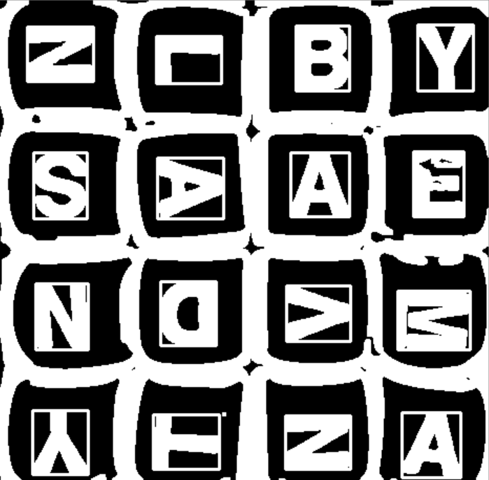

# Boggle Buddy for Android

This is an app companion for the word game Boggle. If uses Open CV and the Tesseract OCR engine  to recognize the tiles on a Boggle board. Given a grid of letters, it solves that Boggle board using DFS on the board graph. It's also linked to the Merriam-Webster API to give word definitions so you can learn as you play!

## Dependencies

* [Open CV 3.4.3 for Android](https://sourceforge.net/projects/opencvlibrary/files/opencv-android/3.4.3/)
* [tess-two](https://github.com/rmtheis/tess-two) (Tesseract Tools for Android)
* [Android Image Cropper](https://github.com/ArthurHub/Android-Image-Cropper)
* [GSON](https://github.com/google/gson)

## The Solver

Doing a DFS from each node in the Boggle graph will generate all possible words. These words are validated against the [North American Scrabble Players Association 2018 Word List](https://en.wikipedia.org/wiki/NASPA_Word_List), and their definitions are pulled from the Merriam-Webster Collegiate Dictionary using their [API](https://dictionaryapi.com/).

## Character Recognition

Given an image cropped aroud the edges of the Boggle board, Open CV is used for some image processing, and then isolates possible letter contours. Here's an example (the white boxes are drawn around the letter contours found by Open CV):

  
 
 These contours are organized in BSTs by their x/y-interval spans in order to attempt and fit the collection to a 4x4 grid. The fit is flexible so some letters can be missed and the 4x4 structure can still be found. The Tesseract OCR engine is then used to identify each character. 

 ## Usage Example

